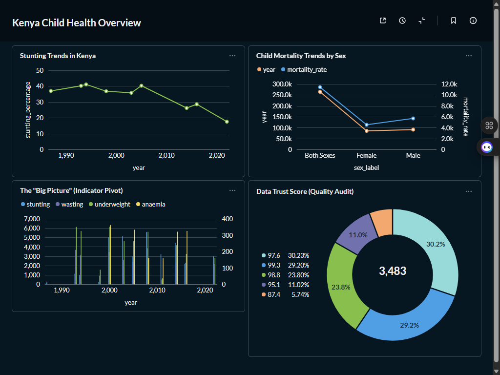

# 🇰🇪 EquityInsight: Kenyan Child Health ETL & Analytics Engine

**EquityInsight** is a self-contained data engineering solution designed to bridge the gap between raw WHO health extracts and professional community health insights. It integrates complex health indicators, performs rigorous data modeling with dbt, and delivers interactive KPIs through a local Metabase dashboard.

---

## 🎯 Project Goal
To provide a demonstrable, end-to-end data pipeline that ingests Kenyan health data, performs Kimball-style star schema modeling, and executes data quality audits to drive insights for community health equity—specifically tailored for the **Living Goods** Data Engineer application.

---

## 🧬 System Architecture
The pipeline is built on an "Orchestrate-Transform-Visualize" logic:

1. **Orchestration (Airflow):** Manages the workflow DAG to schedule ingestion and dbt runs.
2. **Transformations (dbt):** A 3-layer SQL architecture:
   * **Staging:** Cleaning raw CSV headers and casting data types.
   * **Intermediate:** Calculating Year-over-Year (YoY) changes in nutrition indicators.
   * **Marts:** Final Star Schema (`fact_child_health`) for BI consumption.
3. **Quality Engine:** Automated `dbt test` suite validating unique keys, relationships, and health indicator ranges.
4. **BI Layer:** Local Metabase instance connected to Postgres for executive reporting.

---

## 📊 Dashboard Preview

> *Dashboard showing Stunting Trends, Under-5 Mortality KPIs, and Urban/Rural Disparities.*

---

## 🛠️ Technical Stack
| Layer | Tools | Purpose |
| :--- | :--- | :--- |
| **Orchestration** | Apache Airflow 2.9.3 | Workflow scheduling and dependency management |
| **Data Warehouse** | PostgreSQL 15 | Local relational storage for staging and marts |
| **Transformations** | dbt Core | SQL-based Kimball modeling and data testing |
| **Infrastructure** | Docker & Compose | Containerized environment for 100% reproducibility |
| **Analytics** | Metabase | Interactive visualization of health KPIs |

---

## 📂 Project Structure
```text
kenya-health-pipeline/
├── airflow/
│   └── dags/                # Airflow DAG for ETL orchestration
├── dbt/
│   ├── models/              # Staging, intermediate, and marts layers
│   ├── tests/               # Data integrity and validation tests
│   └── profiles.yml         # Connection config (excluded via .gitignore)
├── data/
│   └── raw/                 # health_indicators_ken.csv
├── docs/
│   └── dashboard_screenshot.png # Exported Metabase visual
├── docker-compose.yml       # Local stack infrastructure
└── README.md
```

---

## ⚙️ Installation & Setup

### 1. Launch the Stack
```bash
docker compose up -d
```

### 2. Build the Warehouse
```bash
cd dbt
dbt build
```

---

## 🎓 Skills Demonstrated
* **Modern Data Stack:** Practical experience with Airflow, dbt, and Docker.
* **Health Equity Analysis:** Decomposing WHO indicators into actionable community health metrics.
* **Data Reliability:** Implementing automated testing to ensure 100% data accuracy for NGO decision-making.
